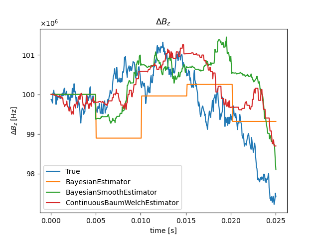
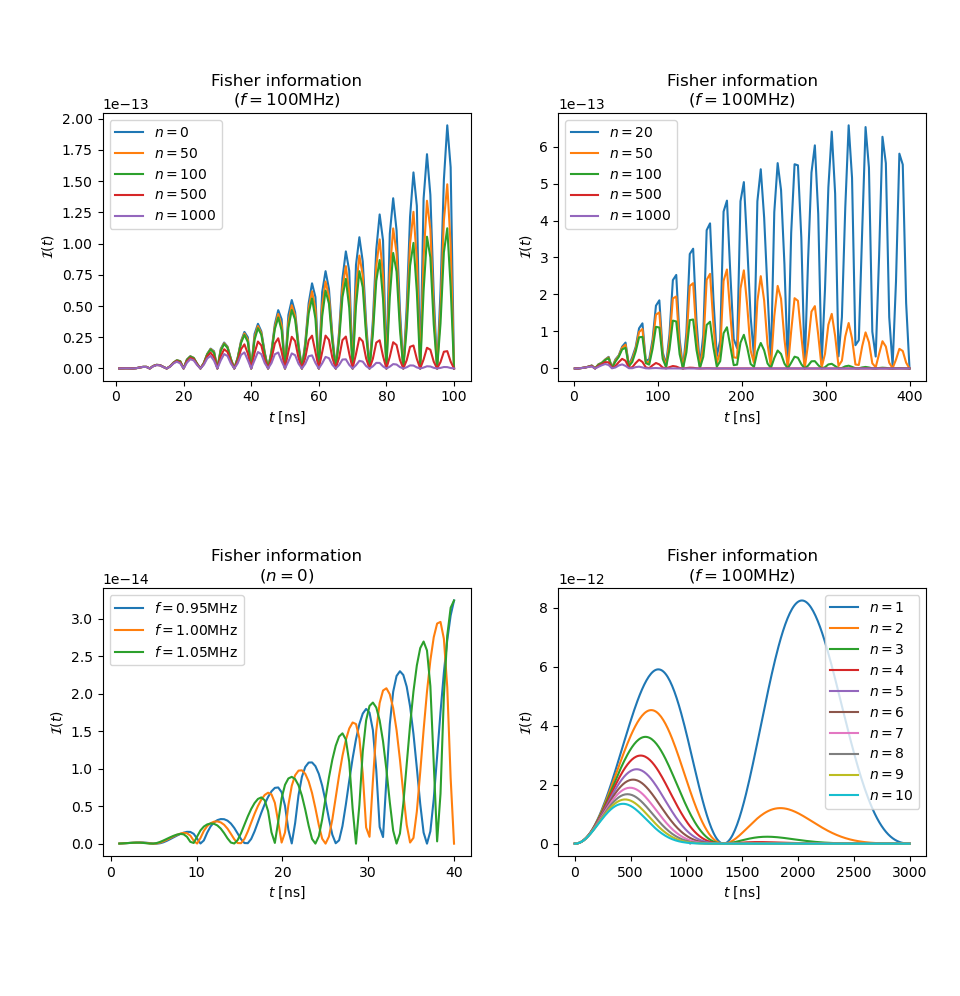

# Frequency Estimator

## Problem Description[1]

1. **(System)** There is a coin of which the head probability oscillates: $$p_{k}(t)
   = \frac{1}{2}(1+\alpha+\beta \cos(2 \pi f_{k}t))$$

1. Frequency $f_{k}$ follows a discrete stochastic process. We assume the Wiener
   process for simplicity. 

   (More real situatioin: [3])

1. **(Observable)** For each step, we can toss a coin at time $t_{k}$ we want and get a datum $d
   \in \{0, 1\}$, which represents head and tail, respectively.

1. **(Estimation)** Assuming that noise in the Wiener process is small enough respect to $t_{k}$,
   how can we estimate $f_{k}$ efficiently?

## Available Methods and Benchmark Results

### Test condition

1. $\Delta f = \Delta W$, $\Delta W \sim N(f_{0}, 2DT)$

## Notes on Estimators

1. The BaumWelch estimator is equivalent to finding the argmax $i$ on pdf
   $P(X_t=i,Y_1,...,Y_t)$, where
   $$P(X_t=i,Y_s)=\int P(Y_s \vert X_s)P(X_s \vert X_t)dX_s.$$
   The filter is just a slightly advanced MLE, which is seem to be worse than a
   MAP Bayesian estimator.

   

   The Bayesians are MAP estimators.

### TODO
   - **Visualization** of an experiment($\Delta B$---$t$ graph) and of
     relationship of MSE to filter parameters.
   - Particle filter
   - Extended Kalman filter
   - Exponential data sampling
   - Implementation of the strategy in [2]

# Finding the Lower Limit of Estimation

### TODO

1. Find the envelope of information dependent on $n$ and time $t$.
1. Construct a strategy to maximize the total information. What will be the
   limit assuming infinite number of samples?
1. Find the **theoretical** minimum variance of estimation.

# Reference

[1] Shulman, M. D., Harvey, S. P., Nichol, J. M., Bartlett, S. D., Doherty, A.
C., Umansky, V., & Yacoby, A. (2014). Suppressing qubit dephasing using
real-time Hamiltonian estimation. Nature Communications 2014 5:1, 5(1), 1–6.
https://doi.org/10.1038/ncomms6156

[2] Ferrie, C., Granade, C. E., & Cory, D. G. (2012). How to best sample a
periodic probability distribution, or on the accuracy of Hamiltonian finding
strategies. Quantum Information Processing 2012 12:1, 12(1), 611–623.
https://doi.org/10.1007/S11128-012-0407-6

[3] Malinowski, F. K., Martins, F., Cywiński, Ł., Rudner, M. S., Nissen, P. D., Fallahi, S., Gardner, G. C., Manfra, M. J., Marcus, C. M., & Kuemmeth, F. (2017). Spectrum of the Nuclear Environment for GaAs Spin Qubits. Physical Review Letters, 118(17), 177702. https://doi.org/10.1103/PhysRevLett.118.177702
